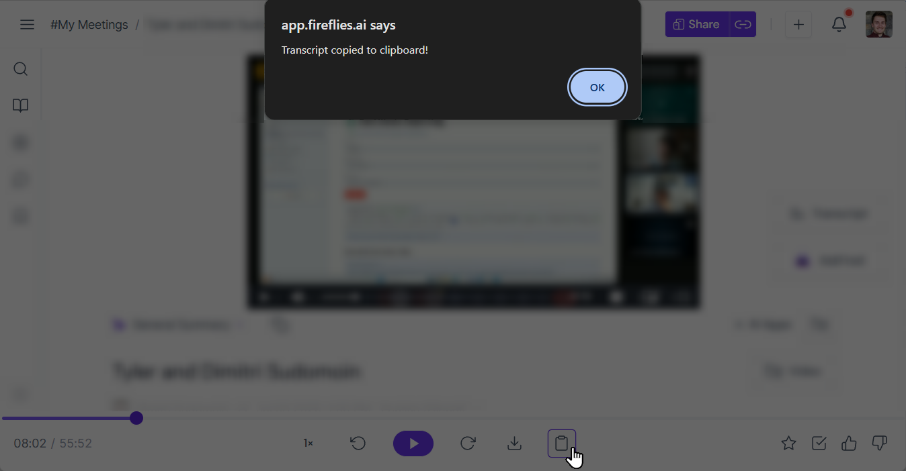

# Fireflies Copy Tools

A Tampermonkey userscript to speed up your [Fireflies.ai](https://fireflies.ai/) workflows. Easily copy clean, plain text transcripts with a single click and (soon) generate truly shareable meeting links.

## The Problem

Fireflies is a fantastic tool, but getting a simple, clean text transcript for your records or for use with an LLM can be a hassle. You either use the API or the native process which involves multiple steps: finding the download button, selecting a format (like `.docx`), downloading the file, opening it, copying the text, and then cleaning up the formatting.

This script streamlines that entire process into a single click.

## Features

-   **One-Click Transcript Copy:** Adds a "Copy Transcript" button directly to the Fireflies.ai media controls, right where you'd expect it.
-   **Clean & LLM-Ready Formatting:** The copied transcript is perfectly structured for readability and easy ingestion by other tools or LLMs. It includes:
    -   The meeting title and date.
    -   A list of all attendees.
    -   Speaker-segmented dialogue with `MM:SS` timestamps marking each speaker change.
-   **Seamless Integration:** The button appears automatically on meeting pages and is styled to match the native Fireflies.ai UI.

## Roadmap (TODO)

- [ ]  **Enhanced Share Link:** The next planned feature is to add a button to generate a truly public, shareable link to the meeting recording. This will work around the "login required" issue present in Fireflies' default sharing links, making it effortless to share recordings with anyone, anywhere.

## Installation

1.  Get a userscript manager. A popular one is [**Tampermonkey**](https://www.tampermonkey.net/) (available for Chrome, Firefox, Safari, and Edge).
2.  Click the link below to install the script: [**>> Install Fireflies Copy Tools <<**](https://raw.githubusercontent.com/Elevate-Code/fireflies-copy-tools-userscript/main/fireflies-copy-tools.user.js)
3.  Your userscript manager will open and ask you to confirm the installation. Just click "Install", refresh the page, and the new button will appear on Fireflies meeting pages.
4.  Fallback: If the link doesn't prompt an install, copy the script's code from [`fireflies-copy-tools.user.js`](fireflies-copy-tools.user.js), open the Tampermonkey dashboard, create a new script, and paste the code in.

## Development & Issues

Found a bug or have a feature request? Please [open an issue](https://github.com/Elevate-Code/fireflies-copy-tools-userscript/issues) on the GitHub repository. All feedback and contributions are welcome!

## License

This project is licensed under the MIT License. See the [LICENSE](LICENSE) file for details.

_A project by [Elevate Code](https://elevatecode.io)._